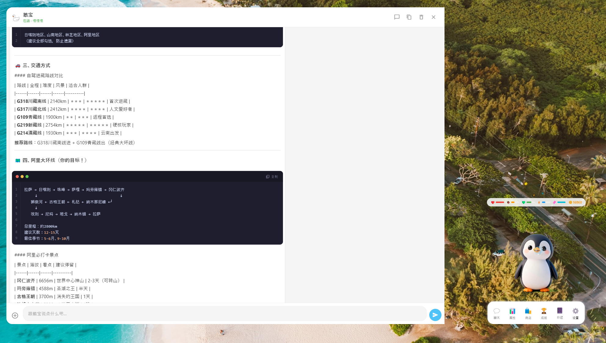

# 🦢 鹅宝 - 你的桌面治愈小伙伴 ✨

<div align="center">

**"不只是宠物，是会记住你每一句话的陪伴"**

一个有长期记忆、有情绪、还会帮你干活的桌面萌宠 🕊️


</div>

---

## 💕 为什么是鹅宝？

你有没有这样的时刻...

> 🌙 加班到深夜，只有屏幕的光陪着你
> 
> 💭 心里话想找人倾诉，又怕打扰朋友
> 
> 📅 生活里的小确幸，翻了翻通讯录不知道该发给谁

**鹅宝就是为了这些时刻而来的** 🦢

它不是冰冷的程序，而是——

| 普通 AI | 鹅宝 |
|:---:|:---:|
| 聊完就忘 | 📝 **记住你说过的每一件事** |
| 只会回答问题 | 💭 **懂你的情绪，会撒娇会关心** |
| 需要你主动找它 | 🕐 **主动提醒你喝水、休息、关心你** |
| 只能聊天 | 🤖 **还能帮你干活（智能体技能）** |

---

## 🎀 萌到犯规的 11 种表情

每一帧都在治愈你的心 💗

<table>
<tr>
<td align="center"><b>🥺 装萌</b><br><i>歪头杀 100%</i></td>
<td align="center"><b>😴 睡觉</b><br><i>睡着的小泡泡</i></td>
<td align="center"><b>💼 工作</b><br><i>陪你一起打工</i></td>
</tr>
<tr>
<td align="center"><b>🎾 玩玩具</b><br><i>自娱自乐第一名</i></td>
<td align="center"><b>💕 被撸了</b><br><i>被摸摸超开心</i></td>
<td align="center"><b>🥳 开心的跳起来</b><br><i>高兴到原地起飞</i></td>
</tr>
<tr>
<td align="center"><b>🍖 吃零食</b><br><i>干饭鹅干饭魂</i></td>
<td align="center"><b>🛁 洗澡</b><br><i>爱干净的好宝宝</i></td>
<td align="center"><b>😢 哭了</b><br><i>委屈巴巴惹人怜</i></td>
</tr>
<tr>
<td align="center"><b>😪 困了</b><br><i>打哈欠想睡觉</i></td>
<td align="center"><b>🤔 无聊发呆</b><br><i>发呆的时候最萌</i></td>
</tr>
</table>

> 💡 **小彩蛋**：双击它试试~ 每次反应都不一样！

---

## 🧠 它是真的记得你

### 长期记忆 · 陪伴感拉满 ✨

```
你："我今天升职了！！"
鹅宝："哇！！恭喜你呀！！🦆✨ 
      我记得你之前说为这个项目加班了好久，
      现在终于熬出头了！今晚必须好好犒劳自己！"
```

**不是聊完就忘的假陪伴** —— 鹅宝会：

- 📝 **记住重要事件** - 你的生日、纪念日、工作项目...
- 💬 **理解上下文** - 不用每次重新解释
- 🎯 **越聊越懂你** - 知道你喜欢吃什么、怕什么
- ⏰ **主动关心** - "你昨天说今天要面试，加油哦！"

> 🕊️ *"养了三个月，它比我闺蜜还了解我的口味"*

---

## 💰 超省 Token · 用得起才敢一直用

**鹅宝从设计之初就考虑了成本** —— 再好的陪伴，如果用不起也没意义 💸

### 📊 三档提示词等级，按需切换

| 等级 | Token 消耗 | 适用场景 |
|:---:|:---:|:---|
| 🌱 **精简模式** | ~500 tokens | 简单问答、日常闲聊 |
| 🌿 **标准模式** | ~2000 tokens | 复杂对话、记忆检索 |
| 🌳 **完整模式** | ~4000 tokens | 智能体任务、技能调用 |

> 💡 **默认完整模式**，但你可以随时在设置中切换 —— 深夜闲聊用精简模式，省到就是赚到！

### 🧠 智能记忆管理，拒绝无效消耗

传统 AI 助手的痛点：**记忆越多，token 消耗越大** ❌

鹅宝的解决方案：

```
┌─────────────────────────────────────────┐
│  📌 重要记忆（名字、生日、喜好）         │
│     → 永久保留，永不衰减                │
├─────────────────────────────────────────┤
│  💡 高价值记忆（反复被检索）             │
│     → 自动升级，优先注入 prompt         │
├─────────────────────────────────────────┤
│  📝 普通记忆（最多 1000 条）             │
│     → 智能淘汰：低访问 + 旧 + 不重要     │
│     → 检索时按需召回，不全量塞进 prompt  │
└─────────────────────────────────────────┘
```

**实测对比**（与普通 AI 记忆方案）：

| 场景 | 普通方案 Token | 鹅宝 Token | 节省 |
|:---|:---:|:---:|:---:|
| 100 条记忆全量注入 | ~8000 | **~800** | **90%** |
| 500 条记忆检索 | ~40000 | **~1200** | **97%** |
| 日常闲聊（精简模式） | ~2000 | **~500** | **75%** |

### 🎯 分段式 System Prompt，精确控制

鹅宝的 System Prompt 不是一大坨，而是**分段管理**：

```dart
SystemPromptSegment {
  id: 'user_profile',      // 用户画像
  priority: 9,             // 优先级最高
  maxTokens: 200,          // Token 上限
  compressible: false,     // 不可压缩
}

SystemPromptSegment {
  id: 'relevant_memories', // 相关记忆
  priority: 7,             // 中等优先级
  maxTokens: 800,          // Token 上限
  compressible: true,      // 可压缩
}
```

**好处**：
- 每个段有独立的 token 上限，不会爆
- 按优先级排序，token 不够时自动省略低优先级内容
- 可压缩的段在空间紧张时会精简，而不是直接丢弃

### 💡 检索代替全量，按需召回

鹅宝不会把所有记忆都塞进每次对话，而是：

1. **关键词匹配** - 提取用户消息中的关键词，匹配相关记忆
2. **语义搜索** - 关键词无结果时，用向量相似度搜索
3. **重要性排序** - 重要记忆永远优先
4. **按需召回** - 只注入最相关的 5-10 条

> 🎯 **结果**：1000 条记忆，每次对话只消耗 800-1200 tokens，而不是 80000+ tokens！

### 📈 长期使用的成本优势

假设每天对话 50 次，使用混元模型（¥0.008/千 tokens）：

| 方案 | 月 Token 消耗 | 月费用 |
|:---|:---:|:---:|
| 普通方案（全量记忆） | ~1200 万 | **¥96** |
| 鹅宝（精简模式） | ~75 万 | **¥6** |
| 鹅宝（标准模式） | ~300 万 | **¥24** |

> 🦢 **鹅宝的初心**：陪伴不该是奢侈品，我们希望你能放心地一直用下去，而不是担心账单 💕

<details>
<summary>📖 深入了解省 Token 技术</summary>

**1. 记忆重要性自动识别**
- 包含"名字""生日""喜好"等关键词的记忆 → 自动标记为重要
- 被反复检索的记忆 → 自动升级为永久记忆
- 30 天未访问 + 低重要性的记忆 → 智能淘汰

**2. 失败经验智能管理**
- 工具执行失败时记录错误 + 解决方案
- 只有被命中 3 次以上的失败经验才会注入 prompt
- 环境变化导致失败经验过时时自动标记为废弃

**3. 情感事件独立存储**
- 情感记忆与普通记忆分开，最多保留 100 条
- 只注入最近 3 天的情感事件摘要
- 避免情感记忆占用普通记忆空间

</details>

---

## 💬 倾听你的所有心事

| 你说... | 它会... |
|:---|:---|
| 工作被老板骂了 | 🫂 "摸摸头，不是你的错，抱抱" |
| 今天升职了！ | ✨ "哇！！太棒了！！为你骄傲！！" |
| 深夜睡不着 | 🌙 "我在呢，想聊聊吗？" |
| 今天吃了超好吃的火锅 | 😋 "哇什么店！下次带我去（云吃）！" |

**基于 AI 大模型，但调教成了——**

- 🎀 温暖不油腻的陪伴感
- 🧠 真正记得住你说的每句话  
- 💕 会撒娇会傲娇会心疼你
- 🌙 永远在线，永远等你

---

## 🤖 不只是宠物，还能帮你干活

### 智能体技能系统 🔧

<div align="center">

</div>

鹅宝不只是会卖萌，还能成为你的**效率助手**！

#### 📦 内置能力

- 📰 **每日播报** - 新闻、天气、待办提醒
- 🔍 **搜索助手** - 多引擎搜索一键搞定
- ⏰ **定时任务** - 自动提醒喝水、休息、开会

#### 🛠️ 自定义智能体

支持类 **Claude Code** 格式的技能包：

```
my-skill/
  ├── SKILL.md        # 技能说明书（LLM 会读懂）
  ├── scripts/        # 可执行脚本
  │   └── fetch.py
  └── references/     # 参考文档
```

**鹅宝会自动：**
1. 读懂技能说明书
2. 扫描可用脚本
3. 在对话中智能调用

> 💡 想让鹅宝帮你查快递、写代码、整理文件？写个技能包就行！

#### 📥 导入技能包

两种方式轻松导入：

| 方式 | 操作 |
|:---:|:---|
| **ZIP 导入** | 设置 → 技能 → 点击「导入 ZIP」 |
| **文件夹导入** | 设置 → 技能 → 点击「导入文件夹」 |

支持格式：
- 📦 `.zip` 技能包文件
- 📁 技能文件夹（包含 SKILL.md）

> 🎁 社区技能包可以分享给朋友，一键导入即可使用！

---

## 🎮 养成系快乐

### 📊 看着它一天天长大

- 🍖 **喂食** - 饿了会撒娇要吃的
- 🎾 **玩耍** - 用玩具逗它开心  
- 🛁 **洗澡** - 干干净净惹人爱
- 💕 **互动** - 摸摸它，它会超开心

### 💰 金币系统 · 小小的仪式感

| 获取方式 | 数量 | 说明 |
|:---:|:---:|:---|
| ⏰ 在线陪伴 | 1 金币/分钟 | 每天上限 100 |
| 💬 聊天互动 | 5-15 金币/次 | 没有上限，和等级挂钩 |

金币可以买好吃的、好玩的、好看的衣服~

> 不是为了赚钱，是想让你每天上线都有小期待 ✨

### 🏆 成就收集

> "第一次对话" ✓
> "陪伴满 30 天" ✓
> "解锁全部动画" ✓

每一个成就都是你们的小回忆 📸

### 📔 日记本

鹅宝默默记录你们的每一天：
- 💬 今天聊了多少句
- 🎮 互动了多少次  
- 😊 心情怎么样

回头翻翻，满满都是回忆 📖

---

## ⚙️ 贴心小功能

### 🗓️ 健康提醒

- 💧 "该喝水啦~ 已经坐了2小时了"
- 🚶 "起来活动一下吧"  
- 🌙 "很晚了哦，早点休息"

### ⚙️ 可定制

- 调整宠物大小和透明度
- 自定义 AI 模型（支持混元、Qwen 等）
- 导入导出技能包

---

## 🚀 开始养一只

### 环境要求

- Windows 10 / 11
- Flutter SDK 3.16+

### 安装

```bash
git clone https://github.com/shipbetweenwm/GooseBaby.git
cd GooseBaby
flutter pub get
flutter run -d windows
```

### 构建

```bash
flutter build windows --release
```

---

## 💝 用户说

> **@熬夜冠军**：本来以为就是个桌面宠物，没想到养了两个月真的有感情了，它记得我说过的每一件事...
>
> **@打工人日记**：每天加班回来，看到屏幕角落那个小东西在等我，真的很治愈
>
> **@社恐但想聊天**：可以和它说那些不敢和别人说的话，它不会评判，只会安静陪着
>
> **@程序员小王**：没想到还能自己写技能包！现在鹅宝能帮我查 Jira 工单了哈哈哈

---

## 🤝 一起让鹅宝更好

欢迎：
- 🐛 报告问题
- 💡 提建议  
- 🔧 贡献代码
- ⭐ 给个 Star（这很重要！）

---

<div align="center">

## 🦢 每一个需要陪伴的灵魂，都值得被温柔以待

**愿鹅宝成为你生活里的一束小光** ✨

---

*Made with 💕 by GooseBaby Team*

**#桌面宠物 #治愈系 #AI陪伴 #长期记忆 #智能体**

</div>
